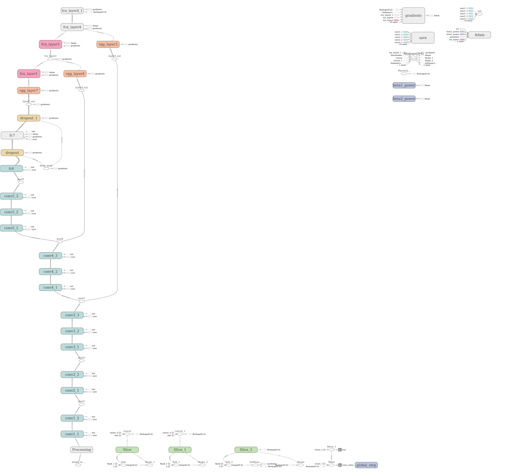
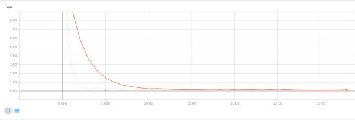

# Semantic Segmentation
### Introduction
In this project, you'll label the pixels of a road in images using a Fully Convolutional Network (FCN).

### Setup
##### Frameworks and Packages
Make sure you have the following is installed:
 - [Python 3](https://www.python.org/)
 - [TensorFlow](https://www.tensorflow.org/)
 - [NumPy](http://www.numpy.org/)
 - [SciPy](https://www.scipy.org/)

##### Dataset
Download the [Kitti Road dataset](http://www.cvlibs.net/datasets/kitti/eval_road.php) from [here](http://www.cvlibs.net/download.php?file=data_road.zip).  Extract the dataset in the `data` folder.  This will create the folder `data_road` with all the training a test images.

### Training
Run the following command to train the fully convolutional network (FCN) for semantic segmentation:
```
python main.py
```

### Project Overview
In this project, I classified the pixels of roads in images using a Fully Convolutional Network (FCN). I played
with epoch size, batch sizes, learning rates and dropouts hyper parameters during training.

### Description
The picture shows the model graph:



To harmonize the images to the numerical constraints, I resized them to 256x512 pixel RGB image.
To double the training data size, I flipped left / right.

As optimizer I choosed the AdamOptimizer that showed good loss reduction. I played to use IOU Metric, but that did not improve the training results.



As trainable variables I selected first only the input node to the decoder and the fcn nodes to improve the performance.

Finally I selected these parameters as practical good solution:

- Epochs: 50
- Batch Size: 1 
- Learning rate: 0.0001
- Dropouts: 0.2


I saved the final model and resulting weights in the [runs](./runs) directory, where all of the latest inference images are also stored.

### Examples
The following give examples of the output of this Fully Convolutional Network for Semantic Segmentation training only FCN variables:


